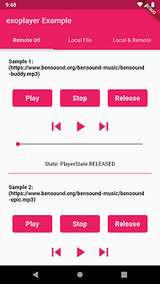
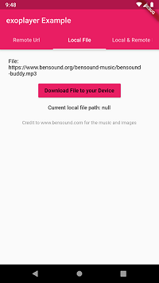

# ExoPlayer

A Flutter plugin that let's you play multiple audio files simultaneously with an option to choose if to play in background or as a forground service, for now works only for Android.

   

## Install

just add this dependency in your pubsec.yaml file:

```yaml
  dependencies:
    exoplayer: ^0.0.1
```

## Support us

If you find a bug or a feature you want to be added to this library go to the github repository [Github](https://github.com/danielR2001/flutter_exoplayer), there you can add a new issue and tell us about the bug/feature, and if you think you can fix/add by yourself I would love to get a PR from you. 

## Usage

An `ExoPlayer` instance can play a single audio at a time. To create it, simply call the constructor:

```dart
  ExoPlayer exoPlayer = ExoPlayer();
```

You can create multiple instances to play audio simultaneously, but only if you choose `playerMode: PlayerMode.BACKGROUND`, because android can't run two similar services.

For all methods that return a `Future<Result>`: that's the status of the operation (Result is an enum which contains 3 options: success, fail and error). If `success`, the operation was successful, If `fail`, you tried to call audio conrolling methods on released audio player (this status is never returned when calling `play` or `playAll`). Otherwise it's the platform native error code.

Logs are disable by default! To debug, run:

```dart
  ExoPlayer.logEnabled = true;
```

### Playing Audio

To play audio you have two options:
1. play single audio.
2. play playlist.

* play single audio.

```dart
  String url = "URL";
  exoplayer.play(url);
```

* play playlist.

```dart
  List<String> urls = ["URL1","URL2","URL3"];
  exoplayer.playAll(urls);
```

The url you pass can be either local direction or network url.

By default the player is set to play in background (Android system can easily kill the Audio player when app is in background), if Player mode is set to FOREGROUND then you need to also pass `audioObject` instance for the foreground notification, respectAudioFocus is set to false (if your app is respectiong audio focus it will pause when other app get's audio focus and duck if other app getting temporary access of audio focus), repeatMode is also set by default to false (every audio source will play only once), and by default the volume is set to max (1.0). To change one or more of this parameters you need to just pass them to play method.

```dart
  final int result = await exoplayer.play(url,
      repeatMode: true,
      respectAudioFocus: true,
      playerMode: PlayerMode.FOREGROUND,
      audioObject: audioObject);
  if (result != 1) {
    print("something went wrong in resume method :(");
  } 
```

```dart
  final int result = await _audioPlayer.playAll(urls,
      repeatMode: true,
      respectAudioFocus: true,
      playerMode: PlayerMode.FOREGROUND,
      audioObjects: audioObjects);
  if (result != 1) {
    print("something went wrong in resume method :(");
  }
```

### Controlling


After you call play you can control you audio with pause, resume, stop, release, next, previous and seek methods.

* Pause: Will pause your audio and keep the position.

```dart
  final int result = await exoplayer.pause();
  if (result != 1) {
    print("something went wrong in pause method :(");
  }
```

* Resume: Will resume your audio from the exact position it was paused on.

```dart
  final int result = await exoplayer.resume();
  if (result != 1) {
    print("something went wrong in resume method :(");
  }
```

* Stop: Will stop your audio and restart it position.

```dart
  final int result = await exoplayer.stop();
  if (result != 1) {
    print("something went wrong in stop method :(");
  }
```

* Release: Will release your audio source from the player (you need to call play again).

```dart
  final int result = await exoplayer.release();
  if (result != 1) {
    print("something went wrong in release method :(");
  }
```

* Next: Will play the next song in the playlist or if playing single audio it will restart the current.

```dart
  final int result = await exoplayer.next();
  if (result != 1) {
    print("something went wrong in resume next :(");
  }
```

* Previous: Will play the previous song in the playlist or if playing single audio it will restart the current.

```dart
  final int result = await exoplayer.previous();
  if (result != 1) {
    print("something went wrong in previous method :(");
  }
```

* Seek: Will seek to the duration you set.

```dart
  final int result = await exoplayer.seek(_duration));
  if (result != 1) {
      print("something went wrong in resume method :(");
  }
```

### Notification Customization

When playing in `PlayerMode.FOREGROUND` then the player will show foreground notification, You can customize it in the `AudioObject` thing like priority/ background color / what actions to show and etc'. 

`NotificationMode` represents the actions you want to show with your notification (previous, play/pause, next), you have the option to choose between: NONE - only play/pause, PREVIOUS - previous and play/pause, NEXT - next and play/pause, and BOTH - that include all actions.

Attention! You need to place your app icon or the icon you want to show in the APP_NAME\android\app\src\main\res\drawable folder (you can drop multiple icons there), if you won`t do so your app will crash because android require a small icon for notification.

```dart
  AudioObject audioObject = AudioObject(
      smallIconFileName: "your icon file name",
      title: "title",
      subTitle: "artist",
      largeIconUrl: "local or network image url",
      isLocal: false,
      notificationMode: NotificationMode.BOTH);
```

### Streams

The Exoplayer supports subscribing to events like so:

#### Duration Event

This event returns the duration of the file, when it's available (it might take a while because it's being downloaded or buffered).

```dart
  exoPlayer.onDurationChanged.listen((Duration d) {
    print('Max duration: $d');
    setState(() => duration = d);
  });
```

#### Position Event

This Event updates the current position of the audio. You can use it to make a progress bar, for instance.

```dart
  exoPlayer.onAudioPositionChanged.listen((Duration  p) => {
    print('Current position: $p');
    setState(() => position = p);
  });
```

#### State Event

This Event returns the current player state. You can use it to show if player playing, or stopped, or paused.

```dart
  exoPlayer.onPlayerStateChanged.listen((PlayerState s) => {
    print('Current player state: $s');
    setState(() => palyerState = s);
  });
```

#### Completion Event

This Event is called when the audio finishes playing; it's used in the loop method, for instance.

It does not fire when you interrupt the audio with pause or stop.

```dart
  exoPlayer.onPlayerCompletion.listen((event) {
    onComplete();
    setState(() {
      position = duration;
    });
  });
```

#### Error Event

This is called when an unexpected error is thrown in the native code.

```dart
  exoPlayer.onPlayerError.listen((msg) {
    print('audioPlayer error : $msg');
    setState(() {
      playerState = PlayerState.stopped;
      duration = Duration(seconds: 0);
      position = Duration(seconds: 0);
    });
  });
```

## Supported Formats

You can check a list of supported formats below:

 - [Android](https://exoplayer.dev/supported-formats.html)

## IOS implementation

If you have the time and want to implement this library on IOS, i would love to get PR, and hopefully add your PR to my library.

## Credits

This project was originally a fork of [luanpotter's audioplayers](https://github.com/luanpotter/audioplayers) that was also originally a fork of [rxlabz's audioplayer](https://github.com/rxlabz/audioplayer), but since we have diverged and added more features.

Thanks for @rxlabz and @luanpotter for the amazing work!
